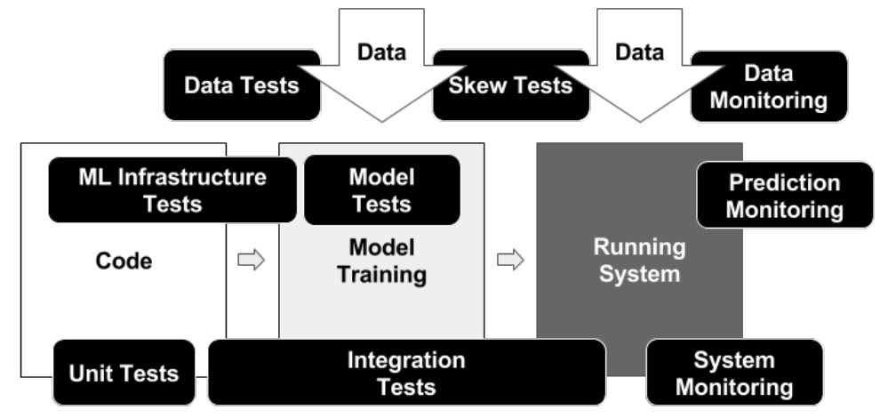

# Software Engineering for ML-Enabled Systems

Christian Kästner

[@p0nk](https://twitter.com/p0nk)

https://github.com/ckaestne/seai

---

<!-- split -->
## Christian Kästner

[@p0nk](https://twitter.com/p0nk)

Associate Professor @ CMU

Interests:
* Software Engineering
* Highly-Configurable Systems & Configuration Engineering
* Sustainability and Stress in Open Source
* Software Engineering for ML-Enabled Systems

---

## Software Engineering for ML-Enabled Systems

> Building, operating, and maintaining software systems with machine-learned components

> with interdisciplinary collaborative teams of 
**data scientists** and **software engineers** 

----
## SE for ML-Enabled Systems != Building models

----

## SE for ML-Enabled Systems != coding ML frameworks

----

## SE for ML-Enabled Systems != ML for SE Tools

----
## SE for ML-Enabled (AI-ML-based, ML-infused) Systems

[temi.com](https://www.temi.com/)

---

<svg version="1.1" viewBox="0.0 0.0 800 400" xmlns:xlink="http://www.w3.org/1999/xlink" xmlns="http://www.w3.org/2000/svg">
	
	<circle r="180" cx="180", cy="200" fill="#b9ff00" fill-opacity="0.514" />
	<circle r="180" cx="620", cy="200" fill="#ff5500" fill-opacity="0.514" />
	<text x=180 y=160 dominant-baseline="middle" text-anchor="middle">Data</text>
	<text x=180 y=240 dominant-baseline="middle" text-anchor="middle">Scientists</text>
	<text x=620 y=160 dominant-baseline="middle" text-anchor="middle">Software</text>
	<text x=620 y=240 dominant-baseline="middle" text-anchor="middle">Engineers</text>
</svg>
----
## Software Engineering

> Software engineering is the branch of computer science that creates practical, cost-effective solutions to computing and information processing problems, preferentially by applying scientific knowledge, developing software systems in the service of mankind. 

Engineering judgements under limited information and resources

A focus on design, tradeoffs, and the messiness of the real world

Many qualities of concern: cost, correctness, performance, scalability, security, maintainability, ...

**"it depends..."**

<!-- references -->
Mary Shaw. ed. [Software Engineering for the 21st Century: A basis for rethinking the curriculum](https://www.cs.cmu.edu/~Compose/SEprinciples-pub-rev2.pdf). 2005.

----
## Most ML Courses/Talks

Focus narrowly on modeling techniques or building models

Using notebooks, static datasets, evaluating accuracy

Little attention to software engineering aspects of building complete systems

----
## Data scientist

* Often fixed dataset for training and evaluation (e.g., PBS interviews)
* Focused on accuracy
* Prototyping, often Jupyter notebooks or similar 
* Expert in modeling techniques and feature engineering
* Model size, updateability, implementation stability typically does not matter
* Starting to worry about fairness, robustness, ...

<!-- split -->

## Software engineer

* Builds a product
* Concerned about cost, performance, stability, release time
* Identify quality through customer satisfaction
* Must scale solution, handle large amounts of data
* Plan for mistakes and safeguards
* Maintain, evolve, and extend the product over long periods
* Consider requirements for security, safety, fairness

----

<svg version="1.1" viewBox="0.0 0.0 800 400" xmlns:xlink="http://www.w3.org/1999/xlink" xmlns="http://www.w3.org/2000/svg">
	
	<circle r="180" cx="180", cy="200" fill="#b9ff00" fill-opacity="0.514" />
	<circle r="180" cx="620", cy="200" fill="#ff5500" fill-opacity="0.514" />
	<text x=180 y=160 dominant-baseline="middle" text-anchor="middle">Data</text>
	<text x=180 y=240 dominant-baseline="middle" text-anchor="middle">Scientists</text>
	<text x=620 y=160 dominant-baseline="middle" text-anchor="middle">Software</text>
	<text x=620 y=240 dominant-baseline="middle" text-anchor="middle">Engineers</text>
</svg>

----

---

# A Software Engineering Perspective on ML

----
## What's different?

* Missing specifications
* Environment is important (feedback loops, data drift)
* Nonlocal and nonmonotonic effects 
* Testing in production
* Data management, versioning, and provenance

----
## Really different?

* Missing specifications -- *implicit, vague specs very common; safe systems from unreliable components* <small>(["ML is requirements engineering"](https://medium.com/@ckaestne/machine-learning-is-requirements-engineering-8957aee55ef4))</small>
* Environment is important -- *the world vs the machine* <small>([paper](https://courses.cs.washington.edu/courses/csep503/19wi/schedule/papers/TheWorldAndTheMachine.pdf))</small>
* Nonlocal and nonmonotonic effects -- *feature interactions, system testing* 
* Testing in production -- *continuous deployment, A/B testing*
* Data management, versioning, and provenance -- *stream processing, event sourcing, data modeling*

----
## Examples of Software Engineering Concerns

* How to build robust AI pipelines and facilitate regular model updates? 
* How to deploy and update models in production? 
* How to evaluate data and model quality in production? 
* How to deal with mistakes that the model makes and manage associated risk?
* How to trade off between various qualities, including learning cost, inference time, updatability, and interpretability? 
* How to design a system that scales to large amounts of data? 
* How to version models and data?
* How to manage interdisciplinary teams with data scientists, software engineers, and operators?

----

https://github.com/ckaestne/seai

----
## My View 

> While developers of simple traditional systems may get away with poor practices, most developers of ML-enabled systems will not.

---
# Quality Assurance for ML-enabled Systems

----
## Traditional Focus: Model Accuracy

* Train and evaluate model on fixed labled data set
* Compare prediction with labels

 

----
## Traditional Focus: Model Accuracy

| | **Actually A** | **Actually not A** |
| --- | --- | --- |
|**AI predicts A** | True Positive (TP) | False Positive (FP) |
|**AI predicts not A** | False Negative (FN) | True Negative (TN) |

Accuary, Recall, Precision, F1-Score

----
## More Traditional Model Quality Discussions

<!-- colstart -->
Many model quality metrics 
(recall, MAPE, ROC, log loss, top-k, ...)

<!-- col -->
Generalization/overfitting (train/test/eval split, crossvalidation)

<small>(CC SA 3.0 by [Dake](https://commons.wikimedia.org/wiki/File:Overfitting.png))</small>

<!-- colend -->

----
## Not all Mistakes are Equal

* False positives vs false negatives (e.g., cancer detection)
* Fairness across subpopulations
* 
* Learn from black-box testing:
	- Equivalence classes
	- Boundary conditions
	- Critical test cases ("call mom")
	- Combinatorial testing
	- Fuzzing

----
## Automating Model Evaluation

* Continuous integration, automated measurement, tracking of results
* Data and model versioning, provenance

<!-- references  -->

Jeremy Hermann and Mike Del Balso. [Meet Michelangelo: Uber’s Machine Learning Platform](https://eng.uber.com/michelangelo/). Blog, 2017

----
## Quality concerns for ML-Enabled Systems

* Learning time, cost and scalability
* Update cost, incremental learning
* Inference cost
* Size of models learned
* Amount of training data needed
* Fairness
* Robustness
* Safety, security, privacy
* Explainability, reproducibility
* Time to market
* Overall operating cost (cost per prediction)

----

---
# Infrastructure Quality

----
## Think of Pipelines, not Models, not Notebooks

Many steps: Data collection, data cleaning, labeling, feature engineering, training, evaluation, deployment, monitoring

Automate each step -- test each step

<!-- references -->

Graphic: Amershi, Saleema, Andrew Begel, Christian Bird, Robert DeLine, Harald Gall, Ece Kamar, Nachiappan Nagappan, Besmira Nushi, and Thomas Zimmermann. "[Software engineering for machine learning: A case study](https://www.microsoft.com/en-us/research/uploads/prod/2019/03/amershi-icse-2019_Software_Engineering_for_Machine_Learning.pdf)." In 2019 IEEE/ACM 41st International Conference on Software Engineering: Software Engineering in Practice (ICSE-SEIP), pp. 291-300. IEEE, 2019.

----
## Possible Mistakes in ML Pipelines

Danger of "silent" mistakes in many phases:

* Dropped data after format changes
* Failure to push updated model into production
* Incorrect feature extraction
* Use of stale dataset, wrong data source
* Data source no longer available (e.g web API)
* Telemetry server overloaded
* Negative feedback (telemtr.) no longer sent from app
* Use of old model learning code, stale hyperparameter
* Data format changes between ML pipeline steps
* ...

----
## Quality Assurance for the Entire Pipeline

<!-- references -->

Source: Eric Breck, Shanqing Cai, Eric Nielsen, Michael Salib, D. Sculley. [The ML Test Score: A Rubric for ML Production Readiness and Technical Debt Reduction](https://research.google.com/pubs/archive/46555.pdf). Proceedings of IEEE Big Data (2017)

----
## Pipeline Testing

* Unit tests (e.g., data cleaning)
* End to end pipeline tests
* Testing with stubs, test error handling (e.g., test model redeployment after  dropped connection)
* Test monitoring infrastructure (e.g., "fire drills")

----

---
# Thinking of the Entire System

> ML models are "just" one component

----
## Living with Mistakes

> The smart toaster may occasionally burn my toast, but it should not burn down my kitchen.

Notes: A smart toaster may occasionally burn the toast, but it should never burn down the kitchen. The latter can be achieved without relying on perfect accuarcy of a smart component, just stop it when it's overheating.

Plan for mistakes: User interaction, undo, safeguards

----
## Model Accuracy vs System Goals 

* System goals are supported by AI components, e.g.,
    - maximizing sales
    - minimizing loss
    - maximizing community growth
    - retaining customers
    - maximizing engagement time
* A better model will support system goals better
    - more accurate
    - faster answers
    - fewer bad mistakes
    - more explainable
    - easier to evolve

----

----

## Testing in Production

> Production data = ultimate unseen data

Focus on system goals, not model accuracy

Monitoring performance over time, canary releases

Finding and debugging common mistakes

Experimentation with A/B tests

----

<!-- references -->
Source: https://www.trendhunter.com/trends/shoegazer

----
## Key Design Challenge: Telemetry

* Identify mistakes in production (“what would have been the right prediction?”)
* Many challenges:
	* How can we identify mistakes? Both false positives and false negatives?
	* How can we collect feedback without being intrusive (e.g., asking users about every interactions)?
	* How much data are we collecting? Can we manage telemetry at scale? How to sample properly?
	* How do we isolate telemetry for specific AI components and versions?

----
## Telemetry Design Examples

* Was there actually cancer in a scan?
* Did we identify the right soccer player?
* Did we correctly identify tanks?
* Was a Youtube recommendation good?
* Was the ranking of search results good?
* Was the weather prediction good?
* Was the translation correct?
* Did the self-driving car break at the right moment?

----

<!-- split -->

Notes:
Expect only sparse feedback and expect negative feedback over-proportionally

----

Notes: Can just wait 7 days to see actual outcome for all predictions
----

Notes: Clever UI design allows users to edit transcripts. UI already highlights low-confidence words, can observe changes in editor (UI design encourages use of editor). In addition 5 star rating for telemetry.

----
## Manually Label Production Samples

----
## Measuring Model Quality with Telemetry

* Telemetry can provide insights for correctness
    - sometimes very accurate labels for real unseen data
    - sometimes only mistakes
    - sometimes indicates severity of mistakes
    - sometimes delayed
    - often just samples, may be hard to catch rare events
    - often just weak proxies for correctness
* Often sufficient to approximate precision/recall or other measures
* Mismatch to (static) evaluation set may indicate stale or unrepresentative test data
* Trend analysis can provide insights even for inaccurate proxy measures

----
## Monitoring Model Quality in Production

* Watch for jumps after releases
    - roll back after negative jump
* Watch for slow degradation
    - Stale models, data drift, feedback loops, adversaries
* Debug common or important problems
    - Mistakes uniform across populations?
    - Challenging problems -> refine training, add regression tests

----
## Engineering Challenges for Telemetry

----

<svg version="1.1" viewBox="0.0 0.0 800 400" xmlns:xlink="http://www.w3.org/1999/xlink" xmlns="http://www.w3.org/2000/svg">
	
	<circle r="180" cx="180", cy="200" fill="#b9ff00" fill-opacity="0.514" />
	<circle r="180" cx="620", cy="200" fill="#ff5500" fill-opacity="0.514" />
	<text x=180 y=160 dominant-baseline="middle" text-anchor="middle">Data</text>
	<text x=180 y=240 dominant-baseline="middle" text-anchor="middle">Scientists</text>
	<text x=620 y=160 dominant-baseline="middle" text-anchor="middle">Software</text>
	<text x=620 y=240 dominant-baseline="middle" text-anchor="middle">Engineers</text>
</svg>

---

<svg version="1.1" viewBox="0.0 0.0 800 400" xmlns:xlink="http://www.w3.org/1999/xlink" xmlns="http://www.w3.org/2000/svg">
	
	<circle r="180" cx="250", cy="200" fill="#b9ff00" fill-opacity="0.514" />
	<circle r="180" cx="550", cy="200" fill="#ff5500" fill-opacity="0.514" />
	<text x=230 y=160 dominant-baseline="middle" text-anchor="middle">Data</text>
	<text x=230 y=240 dominant-baseline="middle" text-anchor="middle">Scientists</text>
	<text x=570 y=160 dominant-baseline="middle" text-anchor="middle">Software</text>
	<text x=570 y=240 dominant-baseline="middle" text-anchor="middle">Engineers</text>
</svg>

----

## Let's Learn from DevOps

Distinct roles and expertise, but joint responsibilities, joint tooling

----
## Toward Better ML-Systems Engineering

Interdisciplinary teams, split expertise, but joint responsibilities

Joint vocabulary and tools

Foster system thinking

Awareness of production quality concerns

Perform risk + hazard analysis

----

<svg version="1.1" viewBox="0.0 0.0 800 400" xmlns:xlink="http://www.w3.org/1999/xlink" xmlns="http://www.w3.org/2000/svg">
	
	<circle r="180" cx="250", cy="200" fill="#b9ff00" fill-opacity="0.514" />
	<circle r="180" cx="550", cy="200" fill="#ff5500" fill-opacity="0.514" />
	<text x=230 y=160 dominant-baseline="middle" text-anchor="middle">Data</text>
	<text x=230 y=240 dominant-baseline="middle" text-anchor="middle">Scientists</text>
	<text x=570 y=160 dominant-baseline="middle" text-anchor="middle">Software</text>
	<text x=570 y=240 dominant-baseline="middle" text-anchor="middle">Engineers</text>
</svg>

---
## Readings

All lecture material: https://github.com/ckaestne/seai

Annotated bibliography: https://github.com/ckaestne/seaibib

<!-- split -->

---
## Summary: Software Engineering for ML-Enabled Systems

* Building, operating, and maintaining systems with ML component
* Data scientists and software engineers have different expertise, both needed
* Quality assurance beyond model accuracy
	- Blackbox testing, test automation
	- Testing the entire ML pipeline
	- Consider whole system
	- Testing in production with telemetry
* Interdisciplinary teams, joint vocabulary, and awareness

kaestner@cs.cmu.edu -- [@p0nk](https://twitter.com/p0nk) -- https://github.com/ckaestne/seai/